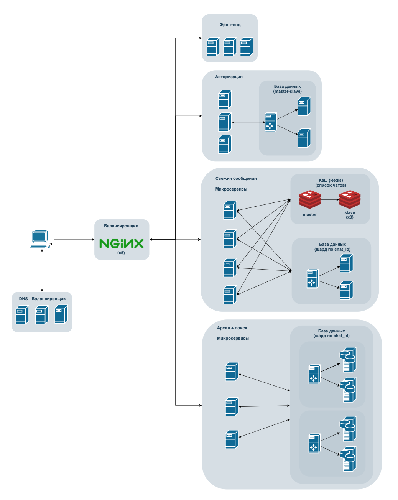

# HW3 (HighLoad App Architecture)

## 1. Выбор темы
Мессенджер

## 2. Определение возможного диапазона нагрузок
* Ежесуточная аудитория 90млн человек ~ ВК
* Ежедневно пользователи отправляют 10млрд сообщений [[1]](https://iz.ru/872421/2019-04-25/chislo-ezhednevnykh-soobshchenii-vkontakte-vyroslo-do-10-mlrd)

## 3. Выбор планируемой нагрузки как 60% доля рынка России
* Количество пользователей = 150млн * 0.6 = 90млн
* Количество пользователей ежесуточно = 90млн * 0.6 = 54млн
* Количество сообщений отправляемых ежесуточно = 10млрд * 0.6 = 6млрд

## 4. Логическая схема базы данных (без выбора СУБД)


[ссылка](https://dbdiagram.io/d/5f9ee9773a78976d7b7a0495)

## 5. Физическая системы хранения (конкретные СУБД, шардинг, расчет нагрузки, обоснование реализуемости на основе результатов нагрузочного тестирования)
Бекенд будет обрабатывать запросы трёх типов:
1. На вставку нового сообщения
2. На загрузку дельты (при запуске приложения)
3. На отправку пушей

Рассчитаем нагрузку каждого из запросов:
1. RPS = кол-во новых сообщений ежесуточно / секунд в сутках = 6млрд / (24 * 60 * 60) = **70к RPS**
2. RPS = кол-во пользователей ежесуточно * кол-во раз приложение запускается в день / секунд в сутках = 54млн * 20 / (24 * 60 * 60) = **12.5к RPS**
3. RPS = RPS(1)

### Алгоритм работы с запросом пользователям


[ссылка](https://drive.google.com/file/d/14qFQHo-laQB-oEzcGPPc0l2xXK0mZ1gP/view?usp=sharing)

Сообщения пользователя кешируются на устройстве. При запуске приложения на сервер отправляется запрос на загрузку новых сообщений (дельты).

Поиск дельты осуществляется следующим образом:
1. На вход сервер получает id пользователя
2. Redis хранит у себя список топ50 чатов пользователя, поэтому он дополняет запрос этим списком
3. Проходит по всем шардам базы данных сообщений, собирая дельту
4. Отправлет данные обратно

Для хранения основных данных я выбрал базу PostgreSQL из-за её сильных сторон:
1. Обширный функционал
2. Большое комьюнити
3. Долгое время на рынке = качество
4. Легко найти разработчиков

Сессии пользователей будем так же хранить в PostgreSQL, а кешировать в cache proxy NGINX.

Один сервер PostgreSQL не способен выдержать нагрузки на 70к вставок, поэтому таблицу сообщений следует шардировать. Принцип шардирования нужно выбрать с учётом следующих требований:
1. Равномерное распределение данных между серверами (mod N)
2. Быстрое выполнение запроса multi-select на поиск дельты
Делаем вывод, что максимально эффективно будет шардировать по полю **chat_id**.

## 6. Выбор прочих технологий
### Back-End
Бекенд для такого сервиса не обладает сложной логикой, однако должен быть максимально быстрым. Подходящие для этого языки: Go, C, C++, Java. Из них я бы выбрал Go, поскольку:
1. Он имеет большую скорость разработки
    1. Не нужно следить за утилизацией памяти (как в C/C++)
    2. Гораздо меньший boilerplate для того же функицонала по сравнению с Java
    3. Параллельность из коробки
2. Он достаточно долго был на рынке:
    1. Большой комьюнити
    2. Большой опыт
3. Он специально создавался как язык для бекенд серверов

### Front-End
Фронтенд для такого сервиса так же не отличается большим функционалом, однако должен правильно уметь правильно реагировать на частое обновления информации на странице. Поэтому для веб версии мы выберем классический набор языков: [HTML](https://ru.wikipedia.org/wiki/HTML), [CSS](https://ru.wikipedia.org/wiki/CSS), [JavaScript](https://ru.wikipedia.org/wiki/JavaScript). 
> JavaScript, а не TypeScript, так же для скорости разработки, поскольку в данном случае нет перемещений и обработки сложных структур данных, поэтому можем пожертвовать статической типизацией

Также я выберу фреймворк React. Причины:
1. Высокая скорость разработки
2. Реактивное программирование обеспечивает быстрый рендер при обновлении информации
3. Большой комьюнити

### Дополнительно
1. Связь между бекендом и фронтендом будет происходить по протоколу [HTTPS](https://ru.wikipedia.org/wiki/HTTPS). Данные передаются в формате [JSON](https://ru.wikipedia.org/wiki/JSON)
2. Система контроля версий - GitHub
3. Непрерывная интеграция - GitHub Actions
4. Автоматический деплой - Ansible (поскольку у нас будет много серверов выполняющих одну логику, удобнее будет использовать именно его)
5. Бекенд будет оформлен в виде нескольких микросервисов (чатов, авторизации, архива и поиска)

## 7. Расчет нагрузки и потребного оборудования
#### Redis
Рассчитаем суммарный объём памяти необходимый для хранения сессий пользователя + список чатов.
`= кол-во пользователей * (размер сессии + (среднее кол-во чатов на пользователя * размер chat_id)) = 90млн * (24B + (50 * 8B)) = 38.16GB`
Таким образом, мы можем уместить всю базу в оперативной памяти одной машины с RAM = 64GB, поэтому мы заведём 4 сервера по модели master-slave с алгоритмом балансировки round-robin.

#### База данных
Рассчитаем средние объемы памяти занимаемые каждой таблицей.

> Веса типов в PostgreSQL:
> * bigint - 8 байт
> * timestamp with time zone - 8 байт
> * varchar(n) - n байт

| Название таблицы                   | users            | chats                | messages            | sessions  |
|------------------------------------|------------------|----------------------|---------------------|-----------|
| Расчёт размера одной записи [байт] | 8 + 8 + (3 * 50) | 8 + 50 + 8 + (4 * 8) | 8 + 8 + 8 + 8 + 256 | 8 + 8 + 8 |
| Размер одной записи [байт]         | 208              | 98                   | 288                 | 24        |
> Принимается среднее число пользователей в одном чате - 4

Принцип шардирования определялся раньше. Теперь же следует определить количество шардов:
`N = (RPS(insert) * коэффициент пиковой нагрузки / макс RPS на одну базу) * кол-во slaves + 1(master) = (70к * 1.5 / 3к) * (2 + 1) = 105` 

"Свежими" данными будем считать сообщения пользователей за последнюю неделю.
```
Количество записей: 6млрд * 7 = 42млрд
Объём памяти: 42 * 10^9 * 288байт = 12ТБ
```
"Старые" данные весят столько же, поэтому каждый месяц их будет генерироваться по 50ТБ.

#### Микросервис (на примере авторизации)
На микросервис авторизации будут приходить запросы только в случае уникального пользователя, либо при истечении срока давности сессии (простой в 7 дней). Расчёт нагрузки:
1. 10 процентов пользователей заходят реже, чем раз в неделю (5.4млн). `5.4млн / (7 * 24 * 60 * 60) = 9RPS`
2. Сервис растёт на 5% ежегодно => 0.42% ежемесячно = `54млн * 0.0042 = 226 800` - прирост пользователей ежемесячно. Все они пойдут первым делом в сервис авторизации. `226 800 / (31 * 24 * 60 * 60) = 0.08RPS`
3. В случае форс-мажора (упала база) и всем пользователям придётся перелогиниться, получим следующую нагрузку: 
`54млн / (24 * 60 * 60) = 625RPS`
4. Вес информации о пользователях (база users): `90млн * 208Б = 19ГБ`
Для обеспечения заданного RPS при условии того, что одно ядро способно выдерживать < 100RPS. При условии, что машины мы берем с 8 ядрами, нам понадобится всего одна машина. В случае выхода её из строя нужно иметь запасные машины, поэтому на весь микросервис возьмём 3 машины.

> Для всех микросервисов расчёт одинаковый

#### Кеш-прокси (для авторизации)
Для снятия нагрузки с микросервиса авторизации поставим перед ним кеш прокси NGINX. Тогда микросервис авторизации будет работать только при отсутствии сессии в кеше. Количество машин для кеша поставим столько же, сколько и на балансировщике входного трафика, чтобы избежать бутылочного горлышка.

#### Фронтенд
Фронтенд будет максимально лёгким (до 5МБ) и для нашей нагрузки (54млн/день) получаем: `5 * 54млн = 270млн МБ/день = 3125МБ/с`
#### Балансировщик
Балансировщиком будет выступать сервер nginx. Для нашей нагрузки (70к RPS и 1-2КБ) подойдёт сервер с 8 ядрами [benchmark](https://www.nginx.com/blog/testing-the-performance-of-nginx-and-nginx-plus-web-servers/). При падении одного сервера не должен ложиться весь сервис, поэтому возмём ещё три запасных, в сумме 4. Помимо этих балансировщиков, необходимы балансировщики перед микросервисами. Перед самым нагруженным (свежих сообщений) поставим 4, перед архивом - 3.

### Подбор оборудования
|                          | CPU(cores) | RAM(GB) | SSD(TB) | Количество  |
|--------------------------|------------|---------|---------|-------------|
| Nginx                    | 8          | 32      | 0.512   | 4           |
| Фронтенд                 | 16         | 64      | 0.512   | 3           |
| Redis                    | 8          | 64      | 1       | 4           |
| Кеш-прокси    		   | 8          | 32      | 0.512   | 4           |
| Авторизация (микро)      | 8          | 32      | 0.512   | 3           |
| Архив + поиск (микро)    | 8          | 32      | 0.512   | 3           |
| Свежие сообщения (микро) | 32         | 128     | 1       | 25          |
| Авторизация (БД)         | 8          | 32      | 4       | 3           |
| Архив + поиск (БД)       | 8          | 64      | 8       | 20 (+7/мес) |
| Свежие сообщения (БД)    | 8          | 32      | 8       | 15          |

## 8. Выбор хостинга / облачного провайдера и расположения серверов
При такой нагрузке и объёме памяти использовать облачные сервисы для основного ядра приложения невыгодно. 

Сервера для жизненно важных микросервисов расположим в Москве, рядом с львиной долью целевой аудитории. 

## 9. Схема балансировки нагрузки (входящего трафика и внутрипроектного, терминация SSL)
Балансировать нагрузку входящего трафика будем с помощью NGINX по модели L7 и с использованием алгоритма Round-Robin. На этом этапе воспользуемся терминацией SSL, имеющейся в NGINX из коробки.

Внутрипроектный трафик (между микросервисами) будем балансировать таким же образом.

## 10. Обеспечение отказоустойчивости
В нашей схеме есть несколько узлов, отказ которых приведёт к частичной или полной деградации сервиса:
* Балансировщик
* Кеш (Redis)
* Микросервисы
* Базы данных

Балансировщики и микросервисы будут обеспечены достаточным количеством копий, для того, чтобы равномерно распределить нагрузку в случае выхода из строя одного из серверов.

Redis и и базы данных застрахованы от падения репликами, выполненными по схеме master-slave. Помимо этого, реплики стоит расположить в разных дата-центрах, чтобы уменьшить риски потери данных.

Помимо этого мы будем пользоваться другими инструментами обеспечения отказоустойчивости, а именно:
* Сбор метрик и анализ показателей серверов
* Наличие алертов на состояние машин
* Частое проведение нагрузочного тестирование
* Суточные дежурства

Исходя из всего вышесказаного можно сделать вывод, что падение падение какой-то машины, нескольких машин, узла или дата-центра не приведёт к полной деградации сервиса
