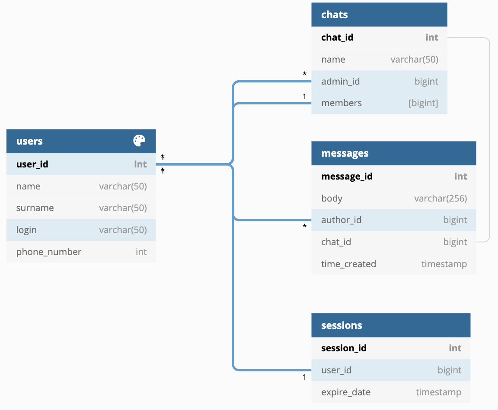

# HW3 (HighLoad App Architecture)

## 1. Выбор темы
Мессенджер

## 2. Определение возможного диапазона нагрузок
* Ежесуточная аудитория 90млн человек ~ ВК
* Ежедневно пользователи отправляют 10млрд сообщений [[1]](https://iz.ru/872421/2019-04-25/chislo-ezhednevnykh-soobshchenii-vkontakte-vyroslo-do-10-mlrd)

## 3. Выбор планируемой нагрузки как 60% доля рынка России
* Количество пользователей = 150млн * 0.6 = 90млн
* Количество пользователей ежесуточно = 90млн * 0.6 = 54млн
* Количество сообщений отправляемых ежесуточно = 10млрд * 0.6 = 6млрд
* RPS = 10млрд * 0.6 / (24 * 60 * 60) = **70к RPS**

## 4. Логическая схема базы данных (без выбора СУБД)


[ссылка](https://dbdiagram.io/d/5f9ee9773a78976d7b7a0495)

## 5. Физическая системы хранения (конкретные СУБД, шардинг, расчет нагрузки, обоснование реализуемости на основе результатов нагрузочного тестирования)
Хранить сессии активных пользователей лучше всего в высокопроизводительной БД, которая стоит перед бекендом и снимает долю нагрузки с него. Возьмём [Redis](https://eax.me/redis/), поскольку он удовлетворяет нашим потребностям по функционалу, лучше своего конкурента Memcached и способен выдерживать заданную нагрузку [benchmark](https://redis.io/topics/benchmarks). Для лучшей производительности стоит завести несколько инстансов (2-4)

Для хранения основных данных я выбрал базу PostgreSQL из-за её сильных сторон:
1. Обширный функционал
2. Большое комьюнити
3. Долгое время на рынке = качество
4. Легко найти разработчиков

Таблица сообщения является основной и наиболее нагруженной. В ней необходимо построить индексы и настроить партицирование по дате, чтобы от увеличения количества сообщений в базе не падало время ответа.

## 6. Выбор прочих технологий
### Back-End
Бекенд для такого сервиса не обладает сложной логикой, однако должен быть максимально быстрым. Подходящие для этого языки: Go, C, C++, Java. Из них я бы выбрал Go, поскольку:
1. Он имеет большую скорость разработки
    1. Не нужно следить за утилизацией памяти (как в C/C++)
    2. Гораздо меньший boilerplate для того же функицонала по сравнению с Java
    3. Параллельность из коробки
2. Он достаточно долго был на рынке:
    1. Большой комьюнити
    2. Большой опыт
3. Он специально создавался как язык для бекенд серверов

### Front-End
Фронтенд для такого сервиса так же не отличается большим функционалом, однако должен правильно уметь правильно реагировать на частое обновления информации на странице. Поэтому для веб версии мы выберем классический набор языков: [HTML](https://ru.wikipedia.org/wiki/HTML), [CSS](https://ru.wikipedia.org/wiki/CSS), [JavaScript](https://ru.wikipedia.org/wiki/JavaScript). 
> JavaScript, а не TypeScript, так же для скорости разработки, поскольку в данном случае нет перемещений и обработки сложных структур данных, поэтому можем пожертвовать статической типизацией

Также я выберу фреймворк React. Причины:
1. Высокая скорость разработки
2. Реактивное программирование обеспечивает быстрый рендер при обновлении информации
3. Большой комьюнити

### Дополнительно
1. Связь между бекендом и фронтендом будет происходить по протоколу [HTTPS](https://ru.wikipedia.org/wiki/HTTPS). Данные передаются в формате [JSON](https://ru.wikipedia.org/wiki/JSON)
2. Система контроля версий - GitHub
3. Непрерывная интеграция - GitHub Actions
4. Автоматический деплой - Ansible (поскольку у нас будет много серверов выполняющих одну логику, удобнее будет использовать именно его)
5. Бекенд будет оформлен в виде нескольких микросервисов (чатов, авторизации, истории и поиска)

## 7. Расчет нагрузки и потребного оборудования
#### База данных
Рассчитаем средние объемы памяти занимаемые каждой таблицей.

> Веса типов в PostgreSQL:
> * bigint - 8 байт
> * timestamp with time zone - 8 байт
> * varchar(n) - n байт

| Название таблицы                   | users            | chats                      | messages                |
|------------------------------------|------------------|----------------------------|-------------------------|
| Расчёт размера одной записи [байт] | 8 + (4 * 50)     | 8 + 50 + 8 + (8 * 4)       | 8 + 256 + 8 + 8 + 8     |
| Размер одной записи [байт]         | 208              | 98                         | 288                     |
> Принимается среднее число пользователей в одном чате - 4

Как уже было сказано выше, таблицу сообщений мы партицируем по дате. Таким образом мы разделяем все данные на условно "свежие" и "старые". Старые данные будут храниться на серверах с большей вместимостью. Свежие же, наоборот, должны отдавать максимально быстро - поэтому у них памяти будет меньше.

"Свежими" данными будем считать сообщения пользователей за последнюю неделю.
```
Количество записей: 6млрд * 7 = 42млрд
Объём памяти: 42 * 10^9 * 288байт = 12ТБ
```
"Старые" данные весят столько же, поэтому каждый месяц их будет генерироваться по 50ТБ.
#### Авторизация
На микросервис авторизации будут приходить запросы только в случае уникального пользователя, либо при истечении срока давности сессии (простой в 7 дней). Расчёт нагрузки:
1. 10 процентов пользователей заходят реже, чем раз в неделю (5.4млн). `5.4млн / (7 * 24 * 60 * 60) = 9RPS`
2. Сервис растёт на 5% ежегодно => 0.42% ежемесячно = `54млн * 0.0042 = 226 800` - прирост пользователей ежемесячно. Все они пойдут первым делом в сервис авторизации. `226 800 / (31 * 24 * 60 * 60) = 0.08RPS`
3. В случае форс-мажора (упала база) и всем пользователям придётся перелогиниться, получим следующую нагрузку: `54млн / (24 * 60 * 60) = 625RPS`
4. Вес информации о пользователях (база users): `90млн * 208Б = 19ГБ`
Таким образом сервис авторизации получается самым ненагруженным, поэтому выделим для него две машины.

#### Фронтенд
Фронтенд будет максимально лёгким (до 5МБ) и для нашей нагрузки (54млн/день) получаем: `5 * 54млн = 270млн МБ/день = 3125МБ/с`
#### Балансировщик
Балансировщиком будет выступать сервер nginx. Для нашей нагрузки (70к RPS и 1-2КБ) подойдёт сервер с 8 ядрами [benchmark](https://www.nginx.com/blog/testing-the-performance-of-nginx-and-nginx-plus-web-servers/). При падении одного сервера не должен ложиться весь сервис, поэтому возмём ещё два запасных, в сумме 3.

### Подбор оборудования
|                  | CPU(cores) | RAM(GB) | SSD/HDD(TB) | Количество  |
|------------------|------------|---------|-------------|-------------|
| Свежие сообщения | **16**     | 64      | 2           | 15          |
| Архив + поиск    | 8          | 32      | **8**       | 20 (+7/мес) |
| Авторизация      | 4          | 32      | 0.512       | 2           |
| Фронтенд         | **16**     | 64      | 0.512       | 3           |
| Nginx            | **8**      | 32      | 0.512       | 3           |
| Redis            | 8          | **32**  | 1           | 4           |

## 8. Выбор хостинга / облачного провайдера и расположения серверов
При такой нагрузке и объёме памяти использовать облачные сервисы для основного ядра приложения невыгодно. 

Сервера для жизненно важных микросервисов расположим в Москве, рядом с львиной частью целевой аудитории. 

## 9. Схема балансировки нагрузки (входящего трафика и внутрипроектного, терминация SSL)
Балансировать нагрузку будем с помощью nginx по модели L7 и с использованием алгоритма Round-Robin. Помимо этого, nginx сможет и терминировать SSL.

## 10. Обеспечение отказоустойчивости
Для обеспечения отказоустойчивости будем использовать схему репликации master-slave. Каждое хранилище имеет минимум две реплики, работающие на отдачу контента и одного мастера, работающего на запись. При отказе реплики, нагрузка на отдачу ложится на другую реплику, при отказе и той - на мастер. При отказе мастера - одна из реплик становится мастером.
